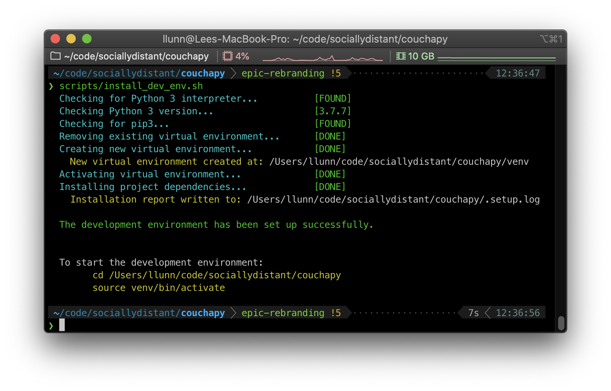

### WARNING -- THIS PACKAGE IS NOT READY FOR USE. -- WARNING

Please check back soon.

# Couchapy

Couchapy is a python library for interacting with [Apache CouchDB](https://couchdb.apache.org).

# Features

- Simple and light-weight - 1 dependency
- Namespace intuitively aligned with CouchDB API namespace  
- Keep-a-live session management
- Integrated Mango query syntax
- Fully encapsulates CouchDB REST API

# Setting up the development environment

Preparing the Couchapy development environment can be done in two ways:

1. Through an automated setup script located in the `scripts` sub-directory
1. Manually

## Automated setup
To configure a development environment automatically, from the project root directory:
```bash
scripts/install_dev_env.sh
```

Expected output


## Manually
Manual configuration of the development environment involves:
1. [Checking python requirements](#step-1:-checking-python-requirements)
1. [Creating a virtual environment](#step-2:-creating-a-virtual-environment)
1. [Installing dependencies](#step-3:-installing-dependencies)

### Step 1: Checking python requirements
Because we love `f-strings`, Couchapy requires Python 3.6.x or later 

To check the python requirements:
```bash
python3 --version
```
Expected output (example)
```console
Python 3.7.7
```

To check pip requirements:
```bash
python3 -m pip --version
```
Expected output (example)
```console
pip 20.0.2 from /usr/local/lib/python3.7/site-packages/pip (python 3.7)
```

### Step 2: Creating a virtual environment
This step is optional, but highly recommended.  

Recommended:
```bash
python3 -m venv venv
```

Optionally:
```bash
python3 -m venv YOUR_CUSTOM_PATH_HERE
```

At this point, the python venv module should have created a virtual environment directory at either `venv` or `YOUR_CUSTOM_PATH_HERE`.

**Notes**:
1. For ease of following documentation (and for the sake of the `.gitignore` entries), it is recommended to use `venv` as the virtual environment name, however, any path can be used.  **For the remainder of the documentation, it assumed that `venv` is the virtual environment name.**

### Step 3: Installing dependencies
For consumers, Couchapy is very light-weight in the dependency department.  However, for development, a few more packages are required, which are predominately for testing purposes.

The development dependencies are located in the `requirements.txt` file in the project root directory.  

To install dependencies, from the project root folder:
```bash
source venv/bin/activate
python3 -m pip install -r requirements.txt
```

# Testing

Couchapy uses pytest and pytest-cov packages for testing and code coverage.

To run tests and genearte a code coverage report, from the project root directory:

```bash
scripts/run_tests.sh
```

Code coverage report is located in `docs/coverage`
